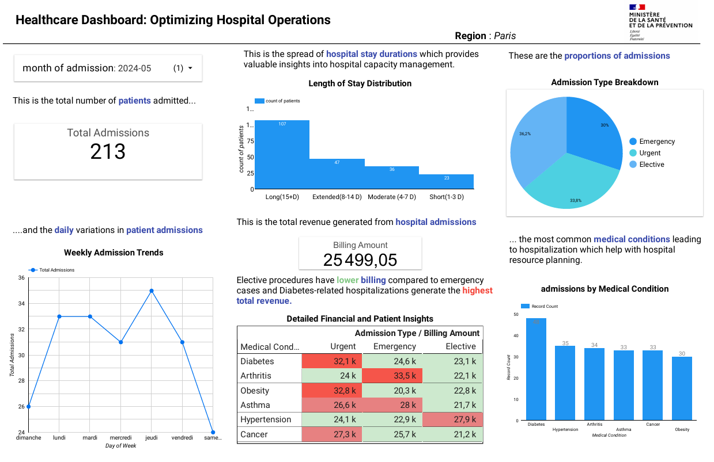

# Healthcare Data Dashboard: Optimizing Hospital Operations

This project focuses on creating an interactive healthcare dashboard to help optimize hospital operations and improve patient care. Built using **Google Looker Studio**, it enables hospital administrators and financial analysts to monitor key metrics like admissions, billing trends, and patient flow.

## 📊 Project Overview
- **Goal:** Provide actionable insights for hospital management and financial planning.
- **Audience:** Hospital Administrators, Managers, and the French Ministry of Health.
- **Tool Used:** [Google Looker Studio](https://lookerstudio.google.com/).
- **Dataset:** Healthcare Dataset from [Kaggle](https://www.kaggle.com/datasets/prasad22/healthcare-dataset).

## 🔗 Dashboard Link
You can explore the dynamic, interactive dashboard here:  
👉 [View Healthcare Dashboard](https://lookerstudio.google.com/reporting/9a0bdf1a-abbf-4f59-8d18-654f343e6ea2)

## 📑 Report
The detailed project report is available : Healthcare Data Dashboard_Data_Visualization_report.pdf

## 🎯 Key Features
- **Admissions Monitoring:** Track patient inflow over time.
- **Medical Condition Analysis:** Identify common hospitalization causes.
- **Admission Type Breakdown:** Emergency vs. elective admissions.
- **Billing Insights:** Analyze average billing amounts and trends.
- **Resource Allocation Support:** Insights to improve efficiency and patient flow.

## 📈 Main Visualizations
- KPI Cards: Total Admissions, Average Billing Amount.
- Line Charts: Weekly and Monthly Admissions Trends.
- Bar Charts: Admissions by Medical Condition.
- Pie Charts: Admission Types Distribution.
- Tables: Billing Summary and Patient Financial Data.
- Histograms: Length of Stay Distribution.

## 🚀 Why Google Looker Studio?
- Easy to use with a drag-and-drop interface.
- Real-time data integration and updates.
- Fully cloud-based and free to use.
- Seamless sharing and collaboration capabilities.

## Results 
- The project successfully utilized Google Looker Studio to create an interactive and user-friendly dashboard for tracking hospital admissions and billing data. By focusing on key metrics like Total Admissions and Billing Amount, and employing effective visualizations such as pie charts,line graphs, etc, the dashboard provides actionable insights into hospital performance.
- The use of clean design, real-time data integration, and intuitive layout ensures that the dashboard remains easy to interpret and navigate, enabling decision-makers to efficiently assess trends and make informed choices.
- Despite some limitations, such as performance with large datasets, Google Looker Studio proved to be a powerful and cost-effective tool for this project, offering a comprehensive solution for monitoring and
analyzing hospital data

Screenshot of the interactive dashboard showing hospital admission and billing insights.
